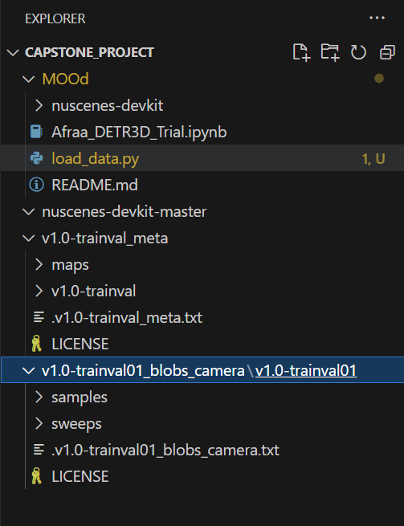

# MOOD: Multi-View Obscured Object Detection
#### Duke University MIDS Capstone Project 2024-2025
**Authors:** Robin Arun, Katie Hucker, Afraa Noureen, Jiayi Zhou

<<<<<<< HEAD
<<<<<<< HEAD
### Katie's filepath just for awareness...

=======
Our project aims to study how different models perform in detecting objects that are partially obscured in natural settings. We have chosen traffic cones from the nuScenes dataset as our target object. NuScenes is an autonomous navigation dataset that includes multiple object classes. We selected traffic cones as the targeted object for their symmetrical shape, immobility, and small size, making them ideal for detection in complex scenes.
=======
## Project Overview 

This project will develop an object detection tool to identify partially obscured objects while leveraging multiple images or views of the object. Current single-view detection methods lack in the ability to render scene contextualization, or reference images near by into its object detection capabilities. We believe by using multi-view modeling techniques obscured objects can be identified quicker, more accurately, and with less dense data. Multi-view models are more computationally complex, therefore, we wish to understand the relationship and improvement when compared to single view detection methods. 

To address this, we will first establish a baseline model, single-view model. We can then advance tomulti-view models like DETR3D, which integrates multiple perspectives to the object detection method. Our approach includes: filtering labeled to obscured objects of interest, implementing the baseline and multi-view models, analysis of methods and performance answering stakeholder driven questions.

### Motivation 
Hidden objects pose significant risks in critical environments, where not finding a partially obscured object can have high-stakes consequences. Some of these high stakes scenarios include: autonoumous car navigation, landmine detection, and search and rescue missions. Traditional object detection methods struggle in these scenarios, often requiring multiple data collects, with the possibility of still not finding the objects due to obscurement. Current multi-view methods are computationally heavy requiring 3D point clouds or rendered scenes. Therefore, this project introduces a '3D interpretation of scenes' to enhance detection accuracy without the heavy overhead of full 3D reconstruction, providing an efficient solution for real-world environments.

### Goal
Develop a model that can accurately detect and classify partially obscured objects by integrating multiple images of a scene, leveraging the spatial relationships among these views for robust detection.

Driving Questions:
- To what extent can multi-view data improve detection accuracy for partially obscured objects?
- How does varying the level of object obscurity impact detection accuracy in multi-view models?
- What is the minimum number of scene views required to achieve reliable detection?
- Which object features most significantly contribute to accurate detection?

## Semester Contributions and Findings

This section describes what is within this repository and our deliverables for the Fall 2024 Semester. 

1. Literature Review
2. Data exploration and description
3. Dataset Prep Toolkit: Dataset filtering and saving
4. YOLO Baseline Model Implementation: Takes dataset, prepares for YOLO model, trains and tests data

### 1. Literature Review 

insert link here 

### Data exploration and description
>>>>>>> c48cdb610c012b4dcdb1afe6a34879eb7897a3cc

One specific question raised by our stakeholders is whether we can study how changes in the visibility levels of traffic cones affect model performance. To address this, we aim to design an experiment that investigates this relationship. As a first step, we analyzed the distribution of visibility levels for traffic cones. Visibility is defined as the fraction of pixels of each annotation visible across six camera feeds and is categorized into four bins: 0-40%, 40-60%, 60-80%, and 80-100%. For instance, a traffic cone with 80-100% visibility indicates that it is almost fully or completely visible. This analysis will help inform the design of our experiment and deepen our understanding of the data distribution.

Based on the visualization, our analysis of 1,378 traffic cones from the nuScenes mini dataset shows that 74% fall within the 80-100% visibility bin, indicating that most cones are highly visible. In contrast, 19% fall within the 0-40% visibility bin, 2% in the 40-60% bin, and 5% in the 60-80% bin. These findings suggest that our dataset is imbalanced, with a significant concentration of cones in the highest visibility bin. If we want to study the effect of traffic cone visibility levels on model performance, to ensure a balanced design for future experiments, we may need to subset the dataset to match the number of cones in the smallest visibility bin (40-60%).
<<<<<<< HEAD
>>>>>>> origin/main
=======

### Dataset Prep Toolkit 

### YOLO Baseline Model Implementation

## Next Steps

#### 1. Train and test YOLO model on the full filtered dataset

The YOLO model was train and tested with randomized very small sample of the original data. We finally have all the data subset to just include traffic cones. We will able to train and test using the YOLO model software already created.

#### 2. DETR3D Model Implementation
   
We will finish implementation of our multi-view model, DETR3D. We expect to have this done by the end of the semester, but we were unable to complete within the 11/15 deadline. We are almost there and will have a similar software toolkit to the YOLO model which is already provided. 

#### 3. Train and test DETR3D model on full filtered dataset

After the modeling code is compelete and works on the subset dataset, we can train and test using the full filtered dataset

#### 4. Return to our driving questions. 
Our driving questions assess the models deeply. These our questions our stakeholder hopes to understand and we will continue to explore. The questions hope to provide answers about the following topics: downsampled data, obscurement level of object vs performance, model explainability via feature analysis.
>>>>>>> c48cdb610c012b4dcdb1afe6a34879eb7897a3cc
